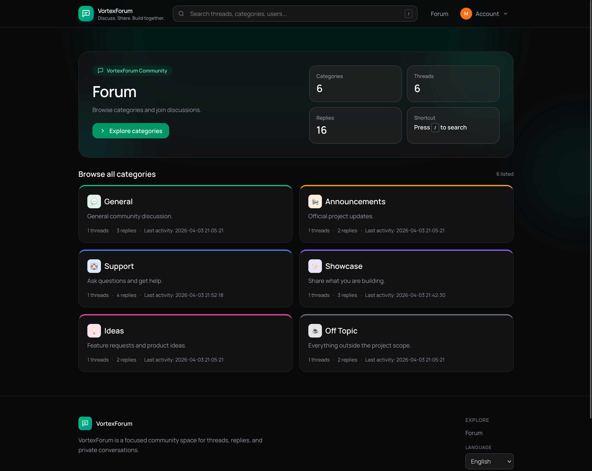
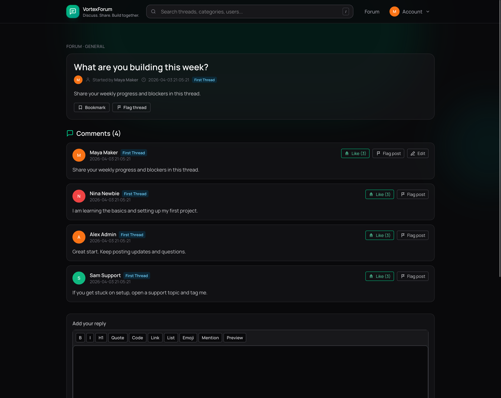
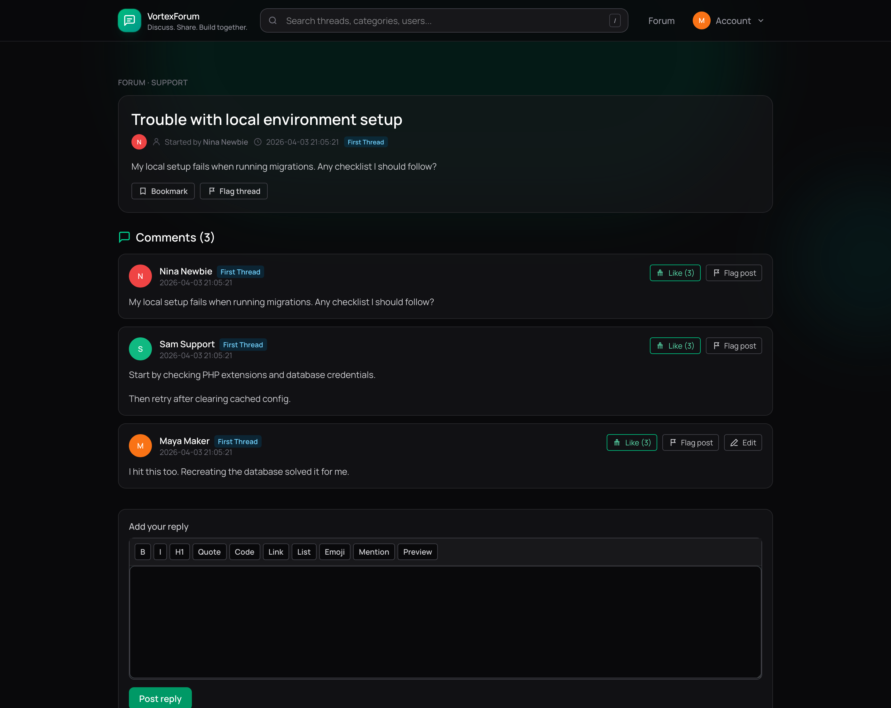
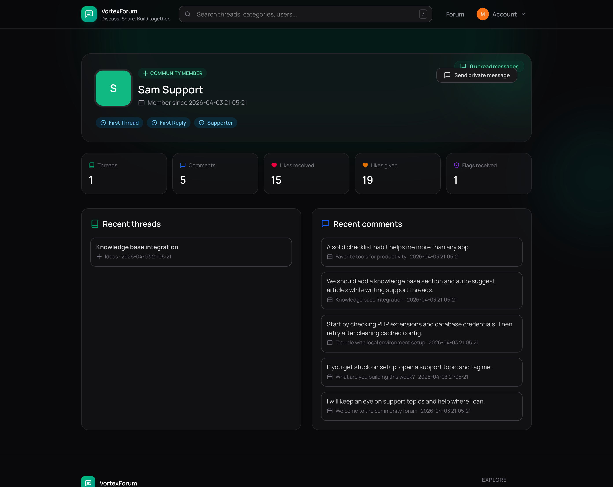
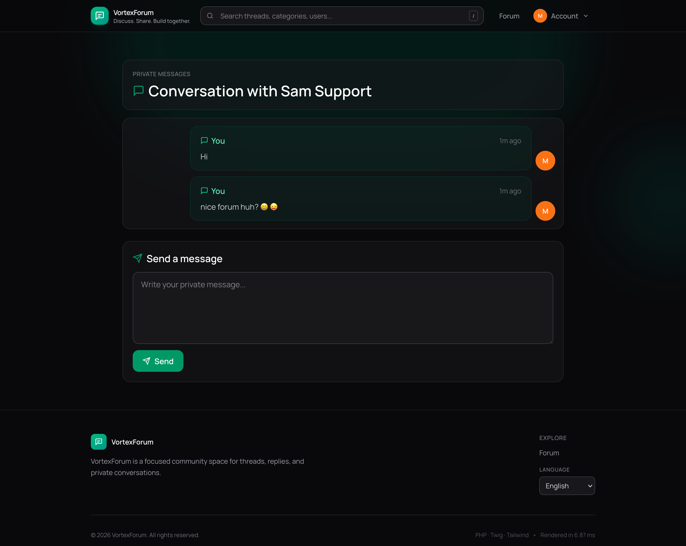

# VortexPHP Forum

A modern community forum application built with PHP 8.2 and VortexPHP.
It includes discussions, moderation tools, private messaging, notifications, and responsive UI workflows for day-to-day community management.



## Performance

Typical forum page render benchmark: `2.99 ms`.

VortexPHP is optimized for very low-latency page delivery.

## Features

- User accounts: registration, login, logout, profile pages, and account settings.
- Structured forum: categories, thread creation, threaded replies, pagination, and tags.
- Rich post flow: markdown rendering, inline post editing, and post likes.
- Thread management: bookmark/unbookmark threads and a dedicated bookmarks page.
- Moderation controls: lock, pin/sticky, and delete thread/post actions for moderators.
- Safety and abuse prevention: CSRF protection, auth middleware, role guards, and request throttling.
- Community tools: report/flag thread and post endpoints.
- Notifications: in-app notifications list with read-state handling.
- Private messages: inbox, conversation view, async feed endpoint, and async send endpoint.
- Search helpers: suggestion endpoint for faster content discovery.
- Localization: multi-language support (`en`, `bg`) via translation files.
- Admin panel at `/admin` (`vortexphp/admin`): CRUD for categories, tags, posts, and users via `app/Admin/Resources` (see `config/admin.php`). User passwords are hashed on create/update (`App\Observers\UserPasswordObserver`).

## Tech Stack

- Backend: PHP 8.2, VortexPHP framework, vortexphp/admin
- Frontend: Twig templates, Tailwind CSS 4
- Content parsing: `league/commonmark`
- Database: SQLite by default (configurable via `.env`)

## Quick Start

### 1) Install dependencies

```bash
composer install
npm install
```

### 2) Configure environment

```bash
cp .env.example .env
```

Set values in `.env` (minimum required):

- `APP_KEY` (generate a secure random key)
- `APP_URL`
- `DB_DRIVER` / `DB_DATABASE` (or MySQL/PostgreSQL variables if used)

### 3) Run migrations

```bash
composer run migrate
```

### 4) Build assets

```bash
npm run build
```

After `composer install` / `update`, package assets (including admin CSS) are published into `public/` automatically. To run that step manually: `composer run publish-assets`.

For local CSS watch mode:

```bash
npm run dev
```

### 5) Start the application

```bash
composer run serve
```

## Available Composer Scripts

- `composer run publish-assets` - copy vortex package assets (e.g. `public/css/admin.css`)
- `composer run serve` - start local development server
- `composer run migrate` - apply database migrations
- `composer run migrate:down` - rollback last migration batch
- `composer run test` - run test suite
- `composer run doctor` - run environment diagnostics
- `composer run smoke` - run smoke checks

## Screenshots





